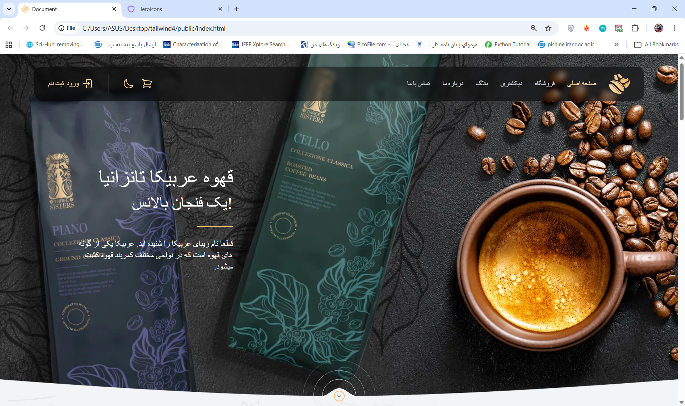
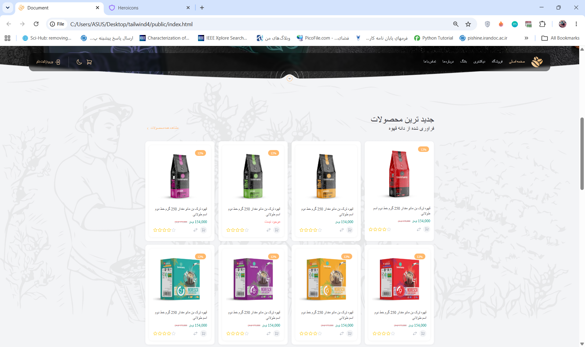
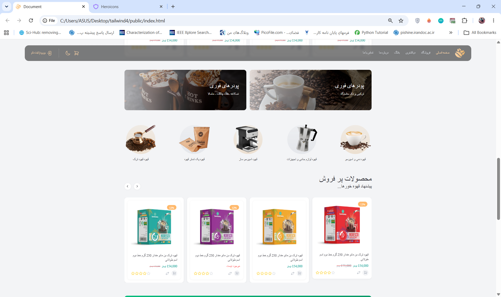
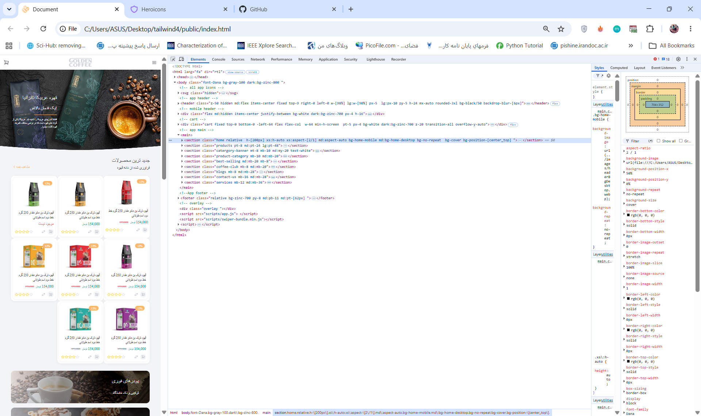
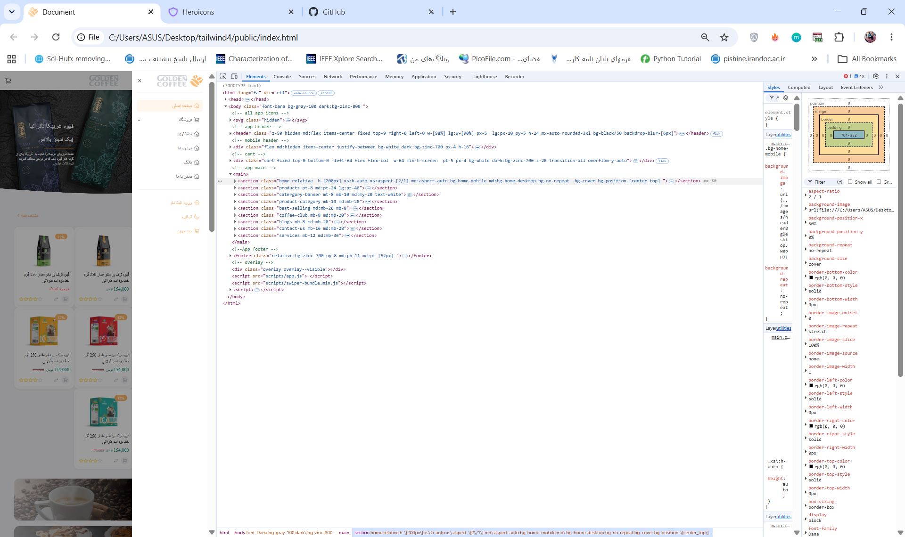
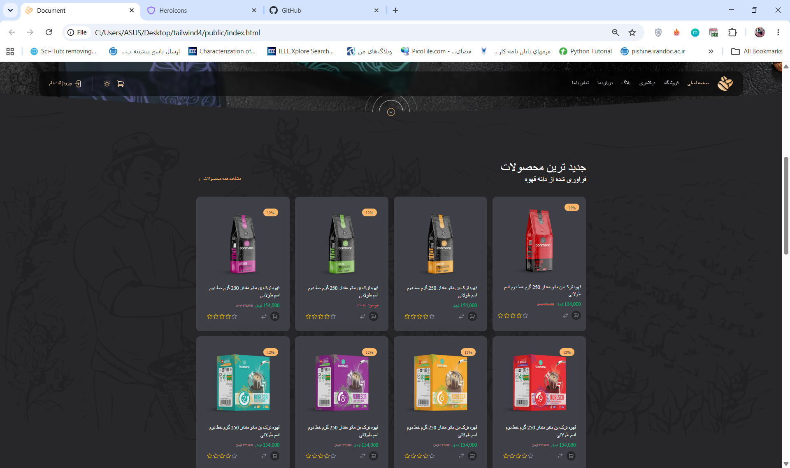
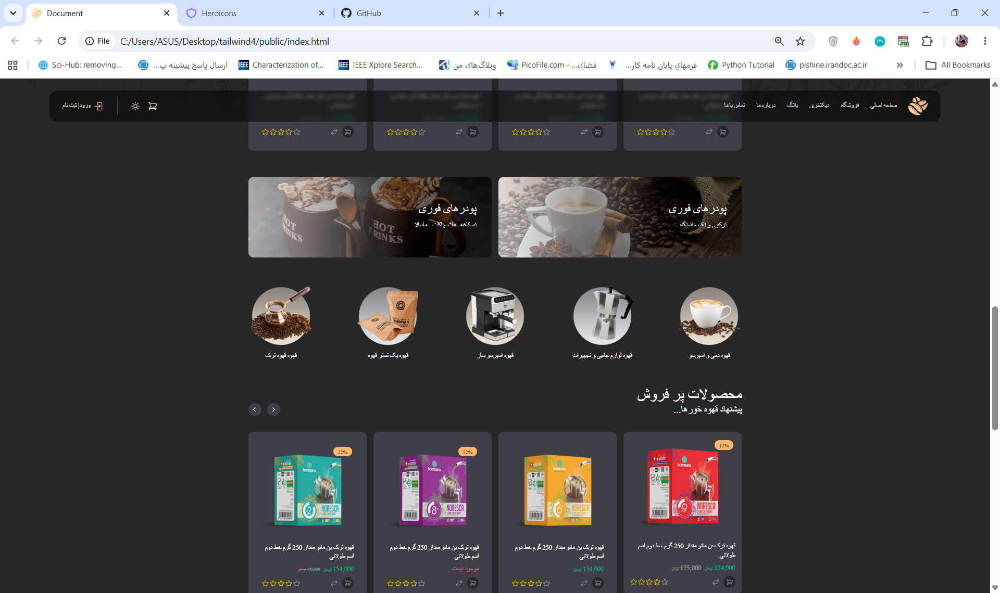

# Tailwind Responsive Website

A modern and responsive RTL website built with **Tailwind CSS** and **JavaScript**.

This project focuses on creating a clean, responsive and user-friendly interface with support for desktop, tablet and mobile screen sizes.

##  Preview

### Desktop







###  Mobile





###  Dark Mode





##  Technologies

* HTML5
* Tailwind CSS
* JavaScript
* Swiper.js
* Responsive Design
* RTL Layout
* Dark Mode

##  Features

* Responsive design for different screen sizes
* RTL support for Persian language
* Dark / Light mode
* Modern user interface
* Responsive navigation
* Product sections
* Swiper slider
* Custom Tailwind CSS theme
* Mobile-friendly layout

## Responsive Design

The website is designed to work across:

* Desktop
* Tablet
* Mobile

##  Dark Mode

The project includes a Dark Mode / Light Mode system implemented with JavaScript.

## Project Structure

```text
tailwind-responsive-website/
│
├── public/
│   ├── index.html
│   ├── scripts/
│   └── styles/
│
├── src/
│   └── input.css
│
├── screenshots/
│   ├── header.png
│   ├── body1.png
│   ├── body2.png
│   ├── mobile1.png
│   └── ...
│
├── package.json
├── package-lock.json
├── tailwind.config.js
└── README.md
```

## Project Status

This project is currently under development.

## Author

**Neda Abasi**

Web Developer

* GitHub: [Neda Abasi](https://github.com/nedaabbasi1991)
* LinkedIn: https://www.linkedin.com/in/neda-abasi-883a511b7

## Note

The repository contains the source code and project screenshots. Some original visual assets such as project images and fonts are not included in the public repository.


------------------------------------------------------------------------------------------------------------------------------------------------       
------------------------------------------------------------------------------------------------------------------------------------------------


# وب‌سایت واکنش‌گرا با Tailwind CSS

یک وب‌سایت مدرن و واکنش‌گرا با پشتیبانی از **زبان فارسی و راست‌چین (RTL)** که با استفاده از **Tailwind CSS** و **JavaScript** طراحی و پیاده‌سازی شده است.

تمرکز اصلی این پروژه بر ایجاد یک رابط کاربری مدرن، مرتب و کاربرپسند با قابلیت نمایش مناسب در اندازه‌های مختلف صفحه‌نمایش است.

##  پیش‌نمایش

###  نسخه دسکتاپ


###  نسخه موبایل


###  حالت تاریک


##  تکنولوژی‌های استفاده‌شده

* HTML5
* Tailwind CSS
* JavaScript
* Swiper.js
* طراحی واکنش‌گرا (Responsive Design)
* راست‌چین (RTL)
* حالت تاریک و روشن (Dark / Light Mode)

##  امکانات پروژه

* طراحی واکنش‌گرا برای اندازه‌های مختلف صفحه‌نمایش
* پشتیبانی از زبان فارسی و راست‌چین
* قابلیت تغییر حالت تاریک و روشن
* رابط کاربری مدرن و کاربرپسند
* منوی واکنش‌گرا
* بخش‌های مختلف محصولات
* استفاده از اسلایدر Swiper
* استفاده از تنظیمات و تم سفارشی Tailwind CSS
* سازگاری با صفحات نمایش موبایل

##  طراحی واکنش‌گرا

این وب‌سایت برای نمایش مناسب در دستگاه‌های مختلف طراحی شده است:

* دسکتاپ
* تبلت
* موبایل

##  حالت تاریک

در این پروژه قابلیت تغییر بین حالت **تاریک و روشن** با استفاده از JavaScript پیاده‌سازی شده است.

## ساختار پروژه

```text
tailwind-responsive-website/
│
├── public/
│   ├── index.html
│   ├── scripts/
│   └── styles/
│
├── src/
│   └── input.css
│
├── screenshots/
│   ├── header.png
│   ├── body1.png
│   ├── body2.png
│   ├── mobile1.png
│   └── ...
│
├── package.json
├── package-lock.json
├── tailwind.config.js
└── README.md
```

## وضعیت پروژه

این پروژه در حال توسعه و تکمیل است.

##  توسعه‌دهنده

**ندا عباسی**

توسعه‌دهنده وب

* GitHub: [Neda Abasi](https://github.com/nedaabbasi1991)
* LinkedIn: https://www.linkedin.com/in/neda-abasi-883a511b7

## توضیحات

این Repository شامل کدهای اصلی پروژه و تصاویر پیش‌نمایش آن است. برخی از فایل‌های گرافیکی و فونت‌های اصلی پروژه به دلیل رعایت حقوق استفاده و حجم Repository در نسخه عمومی GitHub قرار نگرفته‌اند.
